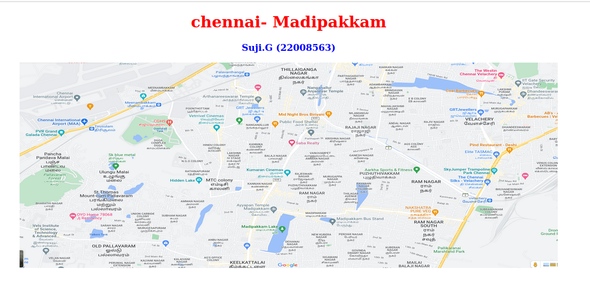
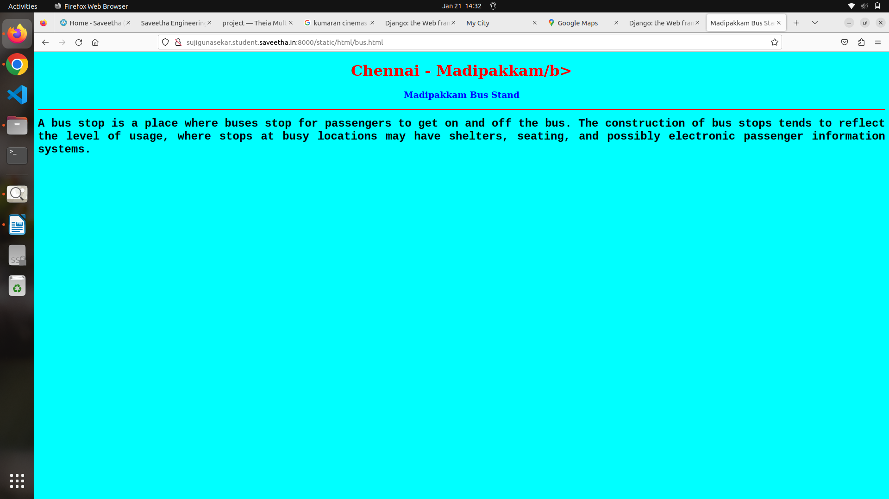
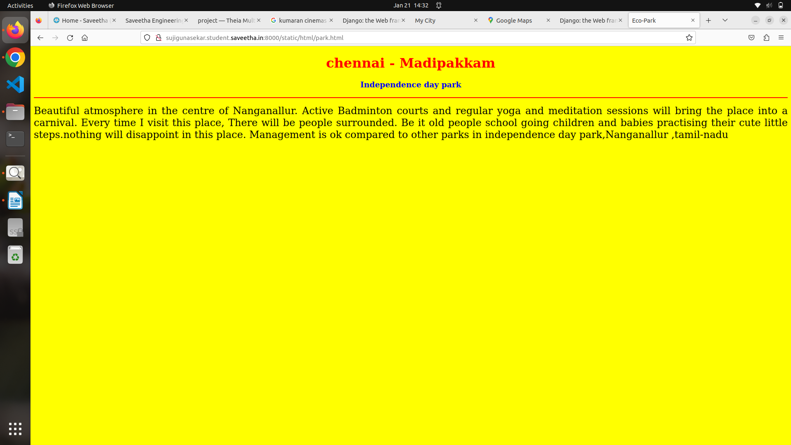
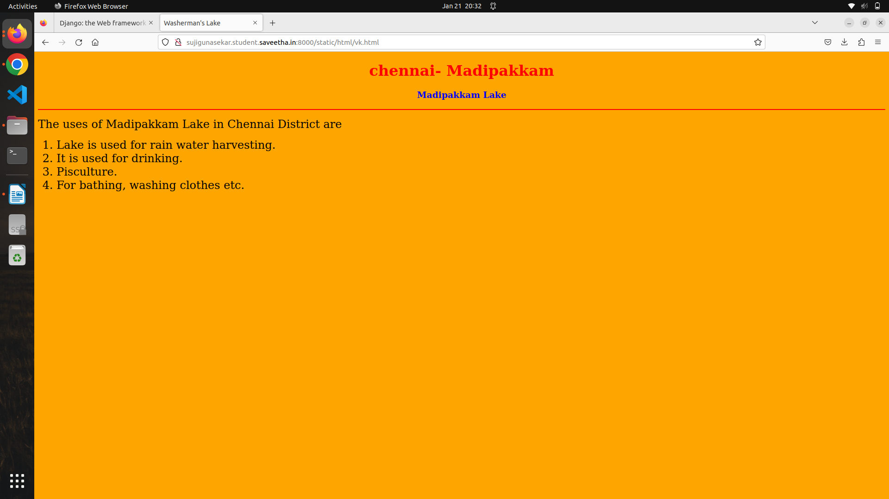
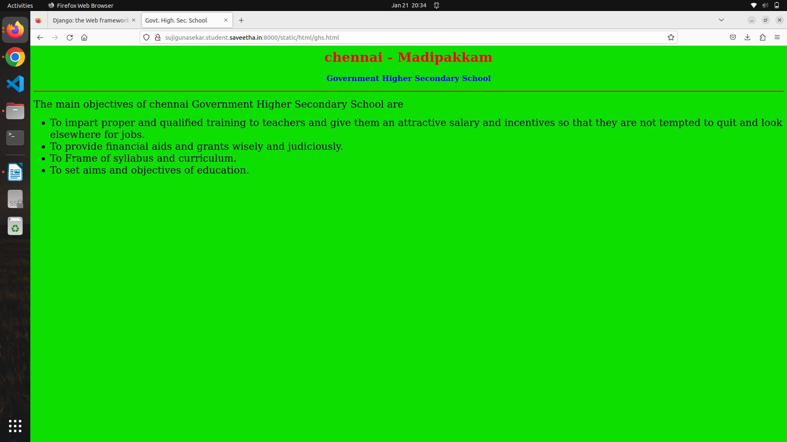
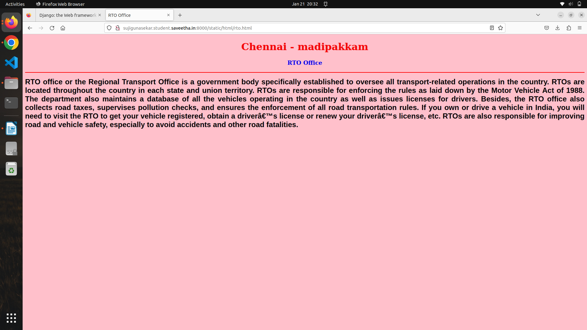
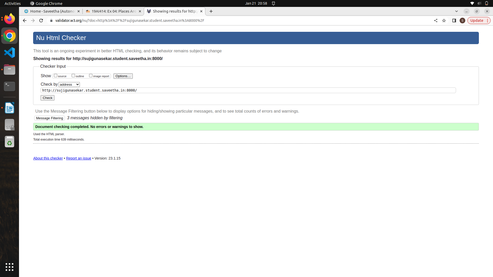

# Places Around Me
## AIM:
To develop a website to display details about the places around my house.

## Design Steps:

### Step 1:
Clone the github repository into Theia IDE.

### Step 2:
Create a new Django project.

### STEP 3:
Write the needed HTML code.

### STEP 4:
Run the Django server and execute the HTML files.


## Code:
```
map.html
<!DOCTYPE html>
<html lang="en">
<head>
<title>My City</title>
</head>
<body>
<h1 align="center">
<font color="red"><b>chennai-  Madipakkam</b></font>
</h1>
<h3 align="center">
<font color="blue"><b>Suji.G (22008563)</b></font>
</h3>
<center>

<map name="MyCity">
<area shape="circle" coords="190,50,20" href="/static/html/ghs.html" title="kumaran cinemas">
<area shape="rectangle" coords="230,30,260,60" href="/static/html/rto.html" title="Ayappan Temple">
<area shape="circle" coords="400,350,50" href="/static/html/vk.html" title="Madipakkam Lake">
<area shape="circle" coords="400,200,75" href="/static/html/bus.html" title="Madipakkam Bus Stand">
<area shape="rectangle" coords="490,150,870,320" href="/static/html/park.html" title="Independence-day Park">
</map>
</center>
</body>
</html>

bus.html
<!DOCTYPE html>
<html lang="en">
<head>
<title> Bus Stand</title>
</head>
<body bgcolor="cyan">
<h1 align="center">
<font color="red"><b>Chennai - Madipakkam/b></font>
</h1>
<h3 align="center">
<font color="blue"><b> Madipakkam Bus Stand</b></font>
</h3>
<hr size="3" color="red">
<p align="justify">
<font face="Courier New" size="5">
<b>
A bus stop is a place where buses stop for passengers to get on and off the bus.
The construction of bus stops tends to reflect the level of usage, where stops at busy locations may have shelters, seating, and possibly electronic passenger information systems. 
</b>
</font>
</p>
</body>
</html>

park.html
<!DOCTYPE html>
<html lang="en">
<head>
<title>Eco-Park</title>
</head>
<body bgcolor="yellow">
<h1 align="center">
<font color="red"><b>chennai -  Madipakkam</b></font>
</h1>
<h3 align="center">
<font color="blue"><b></b>Independence day park</font>
</h3>
<hr size="3" color="red">
<p align="justify">
<font face="Tahoma" size="5">
Beautiful atmosphere in the centre of Nanganallur.
Active Badminton courts and regular yoga and meditation sessions will bring the place into a carnival.
Every time I visit this place, There will be people surrounded. Be it old people school going children and babies practising their cute little steps.nothing will disappoint in this place. 
Management is ok compared to other parks in independence day park,Nanganallur ,tamil-nadu
</font>
</p>
</body>
</html>

ghs.html
html lang="en">
<head>
<title>Govt. High. Sec. School</title>
</head>
<body bgcolor="<!DOCTYPE html>
lime">
<h1 align="center">
<font color="red"><b>chennai - Madipakkam</b></font>
</h1>
<h3 align="center">
<font color="blue"><b>Government Higher Secondary School</b></font>
</h3>
<hr size="3" color="red">
<p align="justify">
<font face="Georgia" size="5">
The main objectives of chennai Government Higher Secondary School are 
<ul>
<li>To impart proper and qualified training to teachers and give them an attractive salary and incentives so that they are not tempted to quit and look elsewhere for jobs.</li>
<li>To provide financial aids and grants wisely and judiciously.</li>
<li>To Frame of syllabus and curriculum.</li>
<li>To set aims and objectives of education.</li>
</ul>
</font>
</p>
</body>
</html>

rto.html
<html lang="en">
<head>
<title>Govt. High. Sec. School</title>
</head>
<body bgcolor="<!DOCTYPE html>
lime">
<h1 align="center">
<font color="red"><b>chennai - Madipakkam</b></font>
</h1>
<h3 align="center">
<font color="blue"><b>Government Higher Secondary School</b></font>
</h3>
<hr size="3" color="red">
<p align="justify">
<font face="Georgia" size="5">
The main objectives of chennai Government Higher Secondary School are 
<ul>
<li>To impart proper and qualified training to teachers and give them an attractive salary and incentives so that they are not tempted to quit and look elsewhere for jobs.</li>
<li>To provide financial aids and grants wisely and judiciously.</li>
<li>To Frame of syllabus and curriculum.</li>
<li>To set aims and objectives of education.</li>
</ul>
</font>
</p>
</body>
</html>

vk.html
<!DOCTYPE html>
<html lang="en">
<head>
<title>Washerman's Lake</title>
</head>
<body bgcolor="orange">
<h1 align="center">
<font color="red"><b>chennai- Madipakkam</b></font>
</h1>
<h3 align="center">
<font color="blue"><b>Madipakkam Lake</b></font>
</h3>
<hr size="3" color="red">
<p align="justify">
<font face="Georgia" size="5">
The uses of Madipakkam Lake in Chennai District are 
<ol type="1">
<li>Lake is used for rain water harvesting.</li>
<li>It is used for drinking.</li>
<li>Pisculture.</li>
<li>For bathing, washing clothes etc.</li>
</ol>
</font>
</p>
</body>
</html>
```


## Output:












### HTML Validator



## Result:
The program for implementing image map is executed successfully.